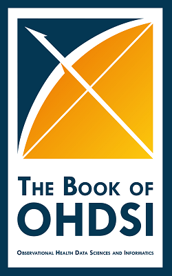

The OHDSI Methods Library is a set of open source R packages for large scale analytics, including population characterization, population-level causal effect estimation, and patient-level prediction.

The packages offer R functions that together can be used to perform an observation study from data to estimates and supporting statistics, figures, and tables. The packages interact directly with observational data in the Common Data Model (CDM),  and are designed to support both large datasets and large numbers of analyses (e.g. for testing many hypotheses including control hypotheses, and testing many analyses design variations). For this purpose, each Method package includes functions for specifying and subsequently executing multiple analyses efficiently. The Methods Library support best practices for use of observational data as learned from previous and ongoing research, such as transparency, reproducibility, as well as measuring of the operating characteristics of methods in a particular context and subsequent empirical calibration of estimates produced by the methods.

## Technology
The Methods Library is a set of R packages that execute against data in a database server. The Library supports traditional database systems (PostgreSQL, Microsoft SQL Server, and Oracle), parallel data warehouses (Microsoft APS, IBM Netezza, and Amazon RedShift), as well as 'Big Data' platforms (Hadoop through Impala, and Google BigQuery). 

# Learn How to Use the Methods Library

 Learn how to use the Methods Library to produce reliable evidence from real-world data with The Book of OHDSI. Read it <a href="http://book.ohdsi.org">online</a>.
